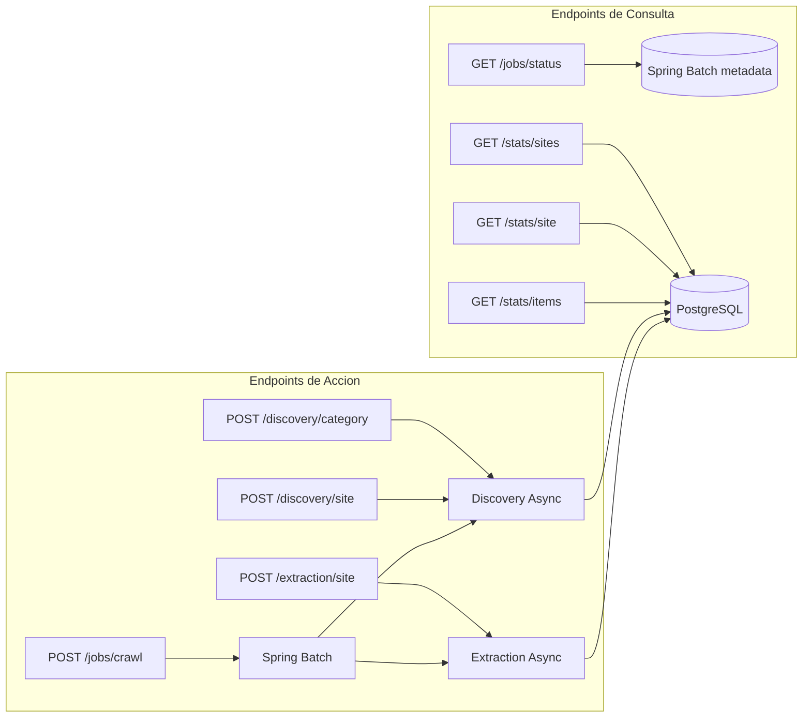

# API REST

## Endpoints

### Discovery

#### `POST /api/discovery/category/{categoryId}`

Inicia el descubrimiento de URLs para una categoria especifica.

**Respuesta:** `200 OK` con mensaje de confirmacion.

**Comportamiento:** Ejecuta de forma asincrona. Navega las paginas de la categoria, extrae links de productos y los guarda como `PENDING` en `discovered_url`.

---

#### `POST /api/discovery/site/{siteId}`

Inicia el descubrimiento para todas las categorias habilitadas de un sitio.

**Respuesta:** `200 OK` con lista de categorias procesadas.

**Comportamiento:** Lanza discovery asincrono para cada categoria con `enabled = true`.

---

### Extraction

#### `POST /api/extraction/site/{siteId}`

Procesa un batch de URLs pendientes para un sitio.

**Respuesta:** `200 OK` con mensaje de confirmacion.

**Comportamiento:** Toma hasta `extraction-batch-size` URLs en estado `PENDING`, las marca `IN_PROGRESS`, extrae datos, y las marca `COMPLETED` o `FAILED`.

---

### Jobs

#### `POST /api/jobs/crawl/{siteId}`

Lanza un crawl job completo (discovery + extraction) para un sitio.

**Respuesta:**
```json
{
  "jobExecutionId": 42,
  "status": "STARTED"
}
```

**Comportamiento:** Ejecuta secuencialmente:
1. `discoveryStep` — descubre URLs de todas las categorias
2. `extractionStep` — extrae datos en batches hasta agotar URLs pendientes

---

#### `GET /api/jobs/status/{jobExecutionId}`

Consulta el estado de un job lanzado.

**Respuesta:**
```json
{
  "jobExecutionId": 42,
  "status": "COMPLETED",
  "startTime": "2024-06-15T10:30:00Z",
  "endTime": "2024-06-15T10:45:00Z",
  "steps": [
    {
      "stepName": "discoveryStep",
      "status": "COMPLETED",
      "startTime": "...",
      "endTime": "..."
    },
    {
      "stepName": "extractionStep",
      "status": "COMPLETED",
      "startTime": "...",
      "endTime": "..."
    }
  ]
}
```

---

### Stats

#### `GET /api/stats/sites`

Lista todos los sitios registrados.

**Respuesta:**
```json
[
  {
    "id": 1,
    "name": "MiTienda",
    "baseUrl": "https://mitienda.com",
    "enabled": true
  }
]
```

---

#### `GET /api/stats/site/{siteId}`

Estadisticas detalladas de un sitio.

**Respuesta:**
```json
{
  "siteId": 1,
  "siteName": "MiTienda",
  "totalUrls": 150,
  "pendingUrls": 10,
  "inProgressUrls": 0,
  "completedUrls": 135,
  "failedUrls": 5,
  "extractedItems": 135,
  "lastCrawlAt": "2024-06-15T10:45:00Z"
}
```

---

#### `GET /api/stats/items`

Items extraidos recientes con paginacion.

**Parametros query:**
| Parametro | Default | Descripcion |
|-----------|---------|-------------|
| `siteId` | - | Filtrar por sitio (opcional) |
| `page` | 0 | Numero de pagina |
| `size` | 20 | Items por pagina |

**Respuesta:**
```json
[
  {
    "id": 42,
    "title": "iPhone 15 Pro",
    "siteId": 1,
    "siteName": "MiTienda",
    "url": "https://mitienda.com/product/iphone-15",
    "properties": { "price": "$999", "brand": "Apple" },
    "extractedAt": "2024-06-15T10:40:00Z"
  }
]
```

---

### Renderer Service (Puerto 3000)

#### `POST /render`

Renderiza una pagina con Chromium headless.

**Request body:**
```json
{
  "url": "https://example.com/page",
  "scrollToBottom": true,
  "maxScrolls": 10,
  "interceptPatterns": ["*/api/products*"],
  "waitForSelector": ".product-grid",
  "timeout": 30000
}
```

**Respuesta:**
```json
{
  "html": "<html>...</html>",
  "interceptedResponses": [
    {
      "url": "https://example.com/api/products?page=1",
      "status": 200,
      "body": "{\"products\": [...]}"
    }
  ]
}
```

---

#### `GET /health`

Health check del servicio renderer.

**Respuesta:** `200 OK` con `{ "status": "ok" }`

## Diagrama de Flujo de Requests


