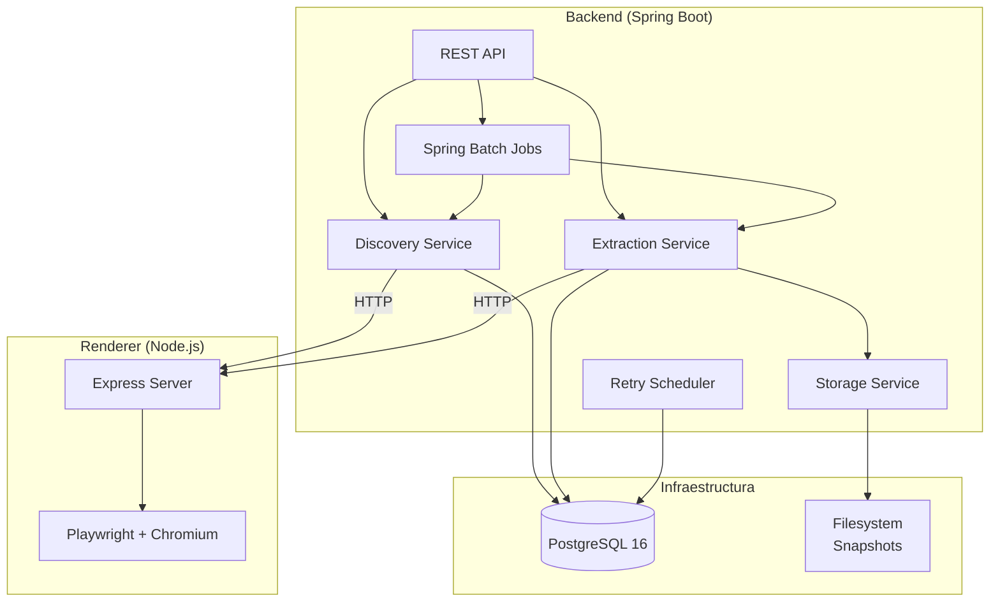

# Arquitectura del Sistema

## Vista General

El crawler es un sistema distribuido de dos componentes que descubre y extrae datos de sitios web. Soporta tanto paginas estaticas (HTML puro) como paginas dinamicas que cargan contenido via JavaScript/AJAX.

## Componentes

### Backend (Spring Boot 4.0.5, Java 25)

El backend es el componente principal que coordina todo el flujo de crawling:

- **REST API**: Endpoints para disparar discovery, extraction, jobs y consultar stats
- **Discovery Service**: Encuentra URLs de productos navegando paginas de categoria
- **Extraction Service**: Extrae datos estructurados de cada URL descubierta
- **Spring Batch**: Orquesta el pipeline completo (discovery -> extraction) como un job
- **Retry Scheduler**: Reintenta periodicamente URLs que fallaron
- **Storage Service**: Persiste snapshots de HTML/JSON en el filesystem

### Renderer (Node.js + Playwright)

Servicio auxiliar que provee renderizado headless para paginas que requieren JavaScript:

- **Express Server**: API HTTP en puerto 3000
- **Playwright**: Controla una instancia de Chromium headless
- Capacidades: scroll infinito, intercepcion de respuestas AJAX, espera por selectores CSS

### PostgreSQL

Base de datos principal con 4 tablas:
- `site`: Configuracion de sitios a crawlear
- `category`: Categorias dentro de cada sitio
- `discovered_url`: URLs encontradas con estado de procesamiento
- `extracted_item`: Datos extraidos de cada URL

## Patrones de Diseno

### Strategy Pattern
La seleccion de estrategia ocurre en dos niveles:
- **Discovery**: `PaginationType` determina si usar Jsoup (estatico) o Playwright (AJAX scroll)
- **Extraction**: `DetailStrategy` determina HTML directo, JSON en scripts, o intercepcion AJAX

### Two-Phase Pipeline
El crawl separa descubrimiento de extraccion, permitiendo:
- Re-ejecutar extraccion sin re-descubrir
- Diferentes velocidades para cada fase
- Reintentos independientes por fase

### Content-Addressed Storage
Los snapshots se nombran con SHA-256 de la URL, garantizando:
- Idempotencia (misma URL → mismo archivo)
- Sin colisiones de nombres
- Path predecible: `{siteId}/{fecha}/{hash}.{ext}`

### Async Execution
Las operaciones costosas se ejecutan de forma asincrona:
- `@Async` launchers con thread pool configurable (core=2, max=4)
- `SimpleAsyncTaskExecutor` para jobs de Spring Batch
- REST endpoints retornan inmediatamente, el procesamiento continua en background
