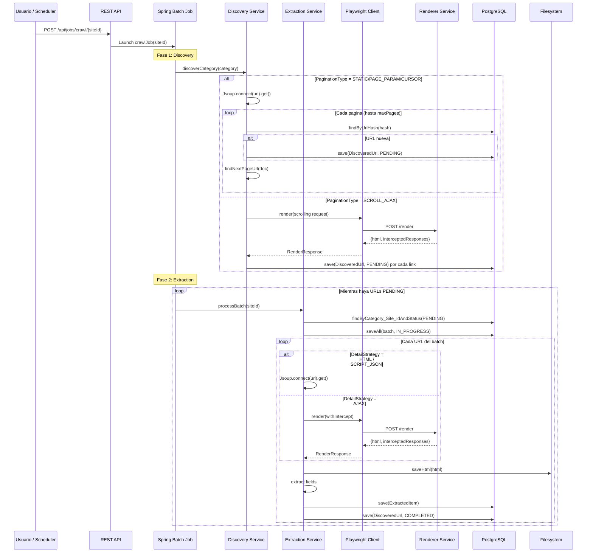
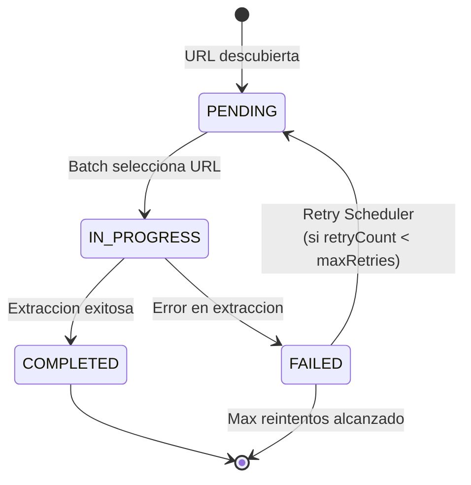
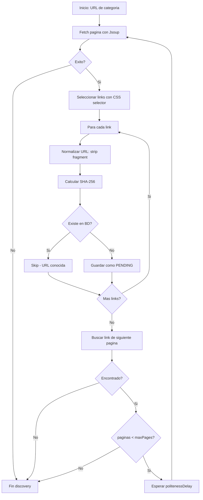
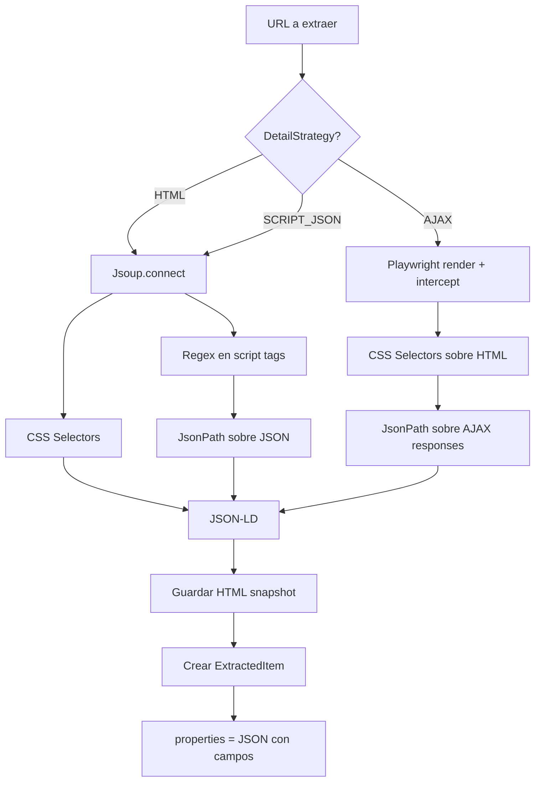
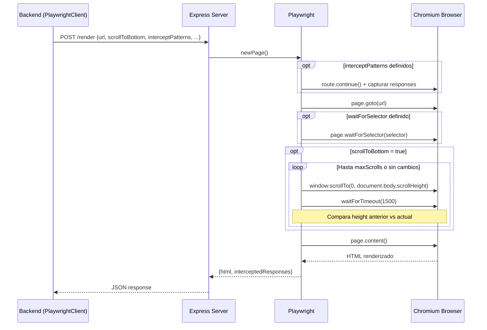

# Flujo de Datos

## Pipeline Completo de Crawling

## Ciclo de Vida de una URL

## Flujo de Discovery con Paginacion (Jsoup)

## Flujo de Extraccion por Estrategia

## Flujo del Renderer (Playwright)

