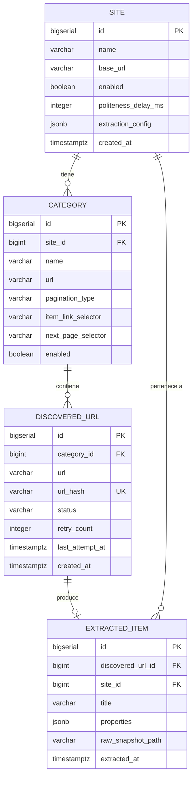

# Modelo de Base de Datos

## Diagrama Entidad-Relacion



## Tablas

### `site`

Configuracion de cada sitio web a crawlear.

| Columna | Tipo | Nullable | Descripcion |
|---------|------|----------|-------------|
| `id` | BIGSERIAL | PK | Identificador auto-generado |
| `name` | VARCHAR(255) | NOT NULL | Nombre unico del sitio |
| `base_url` | VARCHAR(2048) | NOT NULL | URL base del sitio |
| `enabled` | BOOLEAN | NOT NULL | Si el sitio esta activo para crawling |
| `politeness_delay_ms` | INTEGER | NOT NULL | Delay entre requests (ms) |
| `extraction_config` | JSONB | nullable | Configuracion de extraccion |
| `created_at` | TIMESTAMPTZ | NOT NULL | Fecha de creacion |

**`extraction_config` (JSONB):**
```json
{
  "detailStrategy": "HTML | SCRIPT_JSON | AJAX",
  "fieldSelectors": {
    "title": "h1.product-title",
    "price": "span.price"
  },
  "scriptPatterns": ["__NEXT_DATA__\\s*=\\s*(\\{.*?\\});?"],
  "jsonPaths": {
    "productName": "$.props.pageProps.product.name"
  },
  "interceptPatterns": ["*/api/product/*"]
}
```

### `category`

Categorias de productos dentro de cada sitio.

| Columna | Tipo | Nullable | Descripcion |
|---------|------|----------|-------------|
| `id` | BIGSERIAL | PK | |
| `site_id` | BIGINT | FK → site | Sitio padre |
| `name` | VARCHAR(255) | NOT NULL | Nombre de la categoria |
| `url` | VARCHAR(2048) | NOT NULL | URL de la pagina de listado |
| `pagination_type` | VARCHAR(50) | NOT NULL | `PAGE_PARAM`, `CURSOR`, `SCROLL_AJAX` |
| `item_link_selector` | VARCHAR(500) | NOT NULL | CSS selector para links de productos |
| `next_page_selector` | VARCHAR | nullable | CSS selector personalizado para "siguiente pagina" |
| `enabled` | BOOLEAN | NOT NULL | Si la categoria esta activa |

### `discovered_url`

URLs de productos encontradas durante discovery.

| Columna | Tipo | Nullable | Descripcion |
|---------|------|----------|-------------|
| `id` | BIGSERIAL | PK | |
| `category_id` | BIGINT | FK → category | Categoria origen |
| `url` | VARCHAR(2048) | NOT NULL | URL normalizada del producto |
| `url_hash` | VARCHAR(64) | NOT NULL, UNIQUE | SHA-256 de la URL (deduplicacion) |
| `status` | VARCHAR(20) | NOT NULL | `PENDING`, `IN_PROGRESS`, `COMPLETED`, `FAILED` |
| `retry_count` | INTEGER | NOT NULL | Cantidad de reintentos |
| `last_attempt_at` | TIMESTAMPTZ | nullable | Ultima vez que se intento procesar |
| `created_at` | TIMESTAMPTZ | NOT NULL | Fecha de descubrimiento |

**Indices:**
- `uq_discovered_url_hash` (UNIQUE) — deduplicacion por hash
- `idx_discovered_url_status` — consultas por estado

### `extracted_item`

Datos extraidos de cada URL procesada.

| Columna | Tipo | Nullable | Descripcion |
|---------|------|----------|-------------|
| `id` | BIGSERIAL | PK | |
| `discovered_url_id` | BIGINT | FK → discovered_url | URL origen |
| `site_id` | BIGINT | FK → site | Sitio (para consultas rapidas) |
| `title` | VARCHAR(1000) | NOT NULL | Titulo del producto |
| `properties` | JSONB | nullable | Campos extraidos como JSON |
| `raw_snapshot_path` | VARCHAR(1000) | nullable | Ruta relativa del snapshot HTML |
| `extracted_at` | TIMESTAMPTZ | NOT NULL | Fecha de extraccion |

## Migraciones Flyway

| Version | Archivo | Descripcion |
|---------|---------|-------------|
| V1 | `V1__init_schema.sql` | Crea las 4 tablas e indices |
| V2 | `V2__add_next_page_selector.sql` | Agrega `next_page_selector` a `category` |
| V3 | `V3__add_extraction_config.sql` | Agrega `extraction_config` JSONB a `site` |

## Notas

- Todos los IDs usan `BIGSERIAL` (auto-increment de PostgreSQL)
- Timestamps con timezone (`TIMESTAMPTZ`)
- JSONB permite queries sobre la configuracion de extraccion y propiedades extraidas
- El `url_hash` unique index es la barrera principal contra URLs duplicadas
- `retry_count` se incrementa en cada fallo; el scheduler reinicia URLs donde `retry_count < max_retries`
