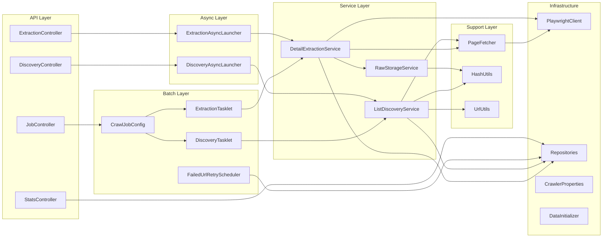

# Modulos del Sistema

## Mapa de Modulos

## Detalle por Modulo

### `crawler.config` — Configuracion

Responsable de toda la configuracion de la aplicacion.

| Clase | Tipo | Descripcion |
|-------|------|-------------|
| `CrawlerProperties` | `@Configuration` | Propiedades `crawler.*` con defaults |
| `AsyncConfig` | `@Configuration` | Thread pool para `@Async` + `JobLauncher` asincrono |
| `DataInitializer` | `CommandLineRunner` | Carga `sites-config.yml` y siembra la BD al inicio |
| `SitesConfig` | POJO | Wrapper: `List<SiteDefinition>` |
| `SiteDefinition` | POJO | Definicion YAML de un sitio con categorias |
| `CategoryDefinition` | POJO | Definicion YAML de una categoria |

### `crawler.discovery` — Descubrimiento de URLs

Navega paginas de categoria para encontrar URLs de productos.

| Clase | Tipo | Descripcion |
|-------|------|-------------|
| `ListDiscoveryService` | `@Service` | Logica core: Jsoup vs Playwright, paginacion, deduplicacion |
| `PlaywrightClient` | `@Component` | WebClient wrapper para el servicio renderer |
| `DiscoveryAsyncLauncher` | `@Component` | Wrapper `@Async` para ejecucion no-bloqueante |
| `DiscoveryController` | `@RestController` | `POST /api/discovery/category/{id}`, `POST /api/discovery/site/{id}` |

**Records internos de `PlaywrightClient`:**
- `RenderRequest` — parametros de renderizado (url, scroll, intercept, timeout)
- `RenderResponse` — HTML + respuestas interceptadas
- `InterceptedResponse` — URL, status code, body de una respuesta AJAX capturada

### `crawler.extraction` — Extraccion de Datos

Extrae datos estructurados de cada URL descubierta.

| Clase | Tipo | Descripcion |
|-------|------|-------------|
| `DetailExtractionService` | `@Service` | Logica core: batch processing, routing de estrategias |
| `ExtractionAsyncLauncher` | `@Component` | Wrapper `@Async` |
| `ExtractionController` | `@RestController` | `POST /api/extraction/site/{id}` |

**Metodos privados de extraccion en `DetailExtractionService`:**
- `extractFromHtml()` — CSS selectors sobre el DOM
- `extractFromScripts()` — regex sobre `<script>` tags
- `extractJsonLd()` — parsea `<script type="application/ld+json">`
- `extractWithJsonPaths()` — aplica JsonPath sobre JSON string

### `crawler.storage` — Almacenamiento de Snapshots

| Clase | Tipo | Descripcion |
|-------|------|-------------|
| `RawStorageService` | `@Service` | Guarda HTML/JSON en `{siteId}/{fecha}/{sha256}.{ext}` |

### `crawler.support` — Utilidades Compartidas

Paquete con utilidades transversales para eliminar duplicacion de codigo entre modulos.

| Clase | Tipo | Descripcion |
|-------|------|-------------|
| `HashUtils` | Utility (final) | SHA-256 hashing centralizado, usado por discovery y storage |
| `UrlUtils` | Utility (final) | Normalizacion de URLs (strip fragment) y resolucion de URLs relativas |
| `PageFetcher` | `@Component` | Fetch de paginas via Jsoup con deteccion de Cloudflare y fallback automatico a Playwright |

### `crawler.job` — Batch Jobs y Scheduling

| Clase | Tipo | Descripcion |
|-------|------|-------------|
| `CrawlJobConfig` | `@Configuration` | Define `crawlJob` = discoveryStep + extractionStep |
| `DiscoveryTasklet` | `Tasklet` | Ejecuta discovery para todas las categorias habilitadas |
| `ExtractionTasklet` | `Tasklet` | Procesa URLs pendientes en batches, loop CONTINUABLE |
| `JobController` | `@RestController` | Launch y status de jobs |
| `StatsController` | `@RestController` | Listado de sitios, stats, items extraidos |
| `FailedUrlRetryScheduler` | `@Scheduled` | Resetea URLs FAILED -> PENDING periodicamente |

### `crawler.model` — Persistencia

**Entidades JPA:**

| Entidad | Tabla | Relaciones |
|---------|-------|------------|
| `Site` | `site` | Tiene muchas `Category` |
| `Category` | `category` | Pertenece a `Site`, tiene muchas `DiscoveredUrl` |
| `DiscoveredUrl` | `discovered_url` | Pertenece a `Category`, tiene `ExtractedItem` |
| `ExtractedItem` | `extracted_item` | Pertenece a `DiscoveredUrl` y `Site` |

**Value Object:**
- `ExtractionConfig` — almacenado como JSONB en `site.extraction_config`

**Enums:**

| Enum | Valores | Proposito |
|------|---------|-----------|
| `PaginationType` | `PAGE_PARAM`, `CURSOR`, `SCROLL_AJAX` | Selecciona estrategia de discovery |
| `DetailStrategy` | `HTML`, `SCRIPT_JSON`, `AJAX` | Selecciona estrategia de extraccion |
| `UrlStatus` | `PENDING`, `IN_PROGRESS`, `COMPLETED`, `FAILED` | Ciclo de vida de URL |

**Repositorios Spring Data:**
- `SiteRepository` — `findByName()`
- `CategoryRepository` — `findBySiteIdAndEnabledTrue()`
- `DiscoveredUrlRepository` — `findByUrlHash()`, `findByCategory_Site_IdAndStatus()`, `resetFailedUrls()`, counts
- `ExtractedItemRepository` — `countBySiteId()`, listados paginados y ordenados

## Renderer Service (Node.js)

Servicio independiente fuera del backend Spring Boot.

| Archivo | Descripcion |
|---------|-------------|
| `renderer/src/index.ts` | Express server: `POST /render`, `GET /health` |
| `renderer/src/renderer.ts` | Logica Playwright: renderizado, scroll, intercepcion de red |

**Capacidades del renderer:**
- Renderizado de paginas con JavaScript
- Scroll automatico hasta el fondo (infinite scroll)
- Intercepcion de respuestas fetch/XHR por patron de URL
- Espera por selectores CSS antes de capturar HTML
- Timeout configurable por request
- Reutilizacion de contexto de browser para performance
